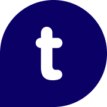

# BonusVarsler

**Trumf | re:member *(kommer snart)* | OBOS *(kommer snart)* | SAS EuroBonus *(kommer snart)***

---

**Glem aldri cashback-bonus igjen!** En lett og stilren nettleserutvidelse som varsler deg når du besøker en nettbutikk som gir bonus.

> 🛒 Dette er et uavhengig hobbyprosjekt og har ingen tilknytning til Trumf, re:member, OBOS, SAS eller andre bonusprogrammer.

- Lynrask og ressursvennlig — du merker ikke at den kjører
- Stilrent design med lys/mørk modus
- Respekterer personvernet ditt — ingen sporing

---

  
  

---

  

## Hvorfor bruke dette?

Bonusprogrammer som Trumf, re:member, OBOS og SAS EuroBonus gir deg cashback hos hundrevis av nettbutikker, men du må huske å gå via deres portal for at bonusen skal registreres. Det er lett å glemme.

Denne utvidelsen løser problemet: Du handler som vanlig, og får et varsel når butikken gir bonus. Ett klikk, så er du i gang.

---

## Funksjoner

- **Fungerer i alle nettlesere** — Chrome, Firefox, Edge, Brave, Opera, Safari
- **Drabar notifikasjon** — Dra varselet til hvilken som helst hjørne, så husker den posisjonen
- **Minimerbar** — Klikk på headeren for å minimere, klikk igjen for å utvide
- **Lys/mørk modus** — Følger systemet ditt, eller velg manuelt
- **Skjul per nettsted** — Får du ikke bonus hos favorittbutikken? Skjul varselet der permanent
- **Adblocker-advarsel** — Bonus-tracking fungerer ikke med adblocker, så du får beskjed
- **Påminnelse på bonusportalen** — Ekstra varsel på bonusportalen så du ikke glemmer å klikke riktig

---

## Installering

### Nettleserutvidelse (anbefalt)

  
  

Manuell installering (for utviklere)

#### Chrome / Edge / Brave / Opera

1. Last ned eller klon dette repositoriet
2. Gå til `chrome://extensions/` (eller tilsvarende for din nettleser)
3. Aktiver "Utviklermodus" øverst til høyre
4. Klikk "Last inn upakket" og velg mappen med utvidelsen

#### Firefox

1. Last ned eller klon dette repositoriet
2. Gå til `about:debugging#/runtime/this-firefox`
3. Klikk "Last midlertidig tillegg..."
4. Velg `manifest.json` i mappen med utvidelsen

> **Merk:** Midlertidige tillegg i Firefox fjernes når nettleseren lukkes.

### Userscript (alternativ)

Foretrekker du en userscript-manager eller bruker iOS? BonusVarsler er også tilgjengelig som userscript.

**1. Installer en userscript-manager:**
- Desktop: [Violentmonkey](https://violentmonkey.github.io/) (anbefalt)
- iOS: [Userscripts](https://apps.apple.com/no/app/userscripts/id1463298887) (gratis)

**2. Installer scriptet:**

**[Klikk her for å installere BonusVarsler (Userscript)](https://github.com/kristofferR/BonusVarsler/raw/main/BonusVarsler.user.js)**

---

## Bruk

Bare surf som vanlig. Når du besøker en nettbutikk som gir bonus, dukker varselet opp.

**Tips:**
- **Dra varselet** til hjørnet du foretrekker — den husker posisjonen
- **Klikk headeren** for å minimere/utvide
- **Tannhjulet** åpner innstillinger (tema, start minimert, skjulte sider)
- **"Ikke vis på denne siden"** skjuler varselet permanent for det nettstedet

### Innstillinger

**Utvidelse:** Høyreklikk på utvidelsesikonet og velg "Alternativer" for å åpne innstillingssiden.

**Userscript:** Høyreklikk på userscript-ikonet for menyvalg.

---

## Personvern

Utvidelsen henter kun offisielle butikklister fra bonusprogrammene. Ingen data om deg eller din surfing sendes noe sted.

---

## Lisens

[GPL-3.0](LICENSE) — fri programvare under GPL v3

---

## Problemer eller forslag?

[Opprett en issue på GitHub](https://github.com/kristofferR/BonusVarsler/issues)
